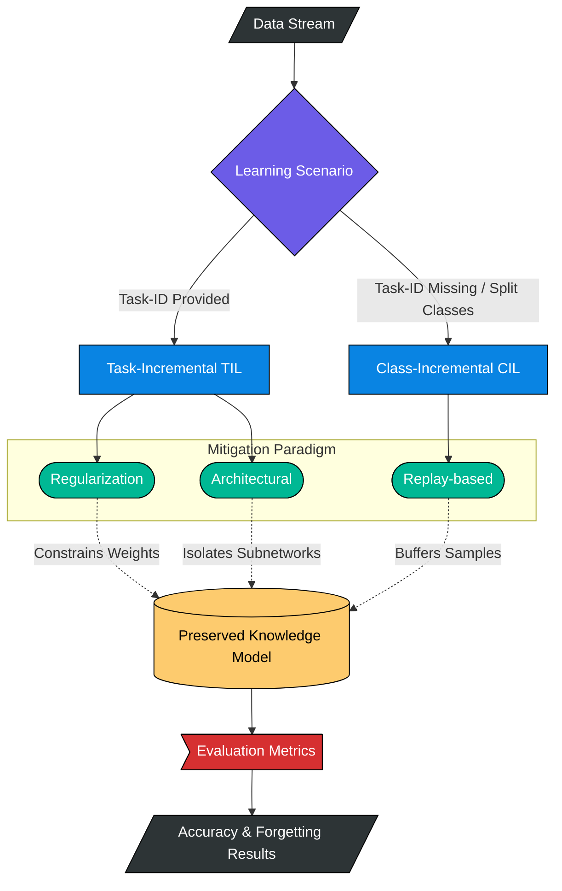
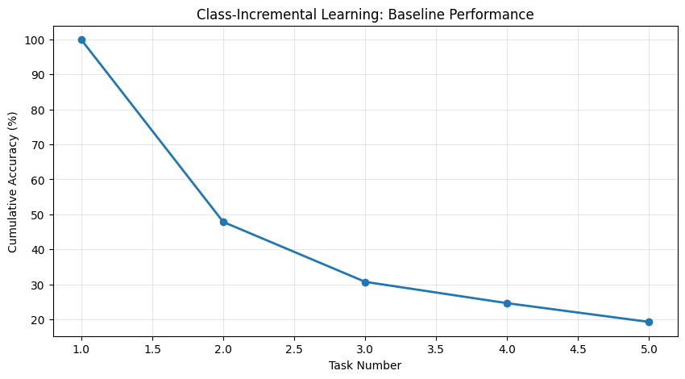
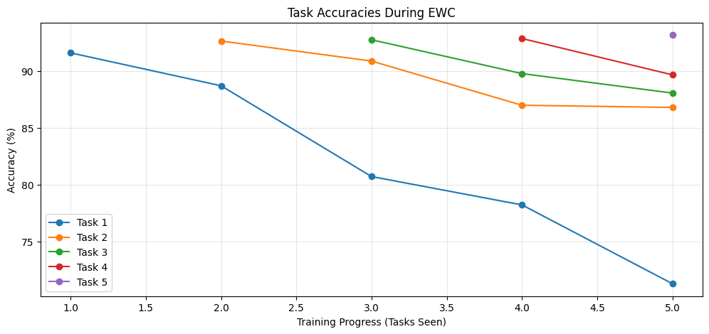

# Catastrophic Forgetting Mitigation

[](#)
[](https://opensource.org/licenses/MIT)
[](#)

A production-grade implementation and comparative study of techniques to mitigate catastrophic forgetting in neural networks. This project enables deep learning models to learn sequentially from new tasks without overwriting previously acquired knowledge, a core requirement for lifelong learning systems.

## The Value Proposition

Traditional neural networks suffer from catastrophic forgetting: when trained on a new task, they abruptly lose performance on previous ones. This repository provides a unified framework to evaluate and deploy state-of-the-art Continual Learning (CL) strategies, including regularization, architectural, and rehearsal-based methods.

## System Architecture

The following diagram illustrates the data flow and mitigation pipeline:



## Key Features

- **Comprehensive Library**: Implementations of EWC, SI, PackNet, and Experience Replay.
- **Dual Scenarios**: Support for both Task-Incremental (Permuted MNIST) and Class-Incremental (Split-MNIST) learning.
- **Modular Design**: Core logic decoupled from execution, allowing easy extension of new models or datasets.
- **Unified CLI**: Single entry point for running large-scale experiments.

## Getting Started

### Prerequisites
- Python 3.8+
- PyTorch 2.0+

### Installation
```bash
# Clone the repository
git clone https://github.com/aniketqxp/catastrophic-forgetting-mitigation.git
cd catastrophic-forgetting-mitigation

# Install dependencies
pip install -r requirements.txt
```

### Quick Start
Run a baseline experiment using the unified CLI:
```bash
python main.py --method baseline --tasks 5 --epochs 5
```

Or run Elastic Weight Consolidation (EWC) to see mitigation in action:
```bash
python main.py --method ewc --tasks 5 --epochs 5
```

## Results Visualization

Detailed metrics and learning curves are generated for every run.

### The Problem: Baseline Accuracy Collapse

*Figure 1: Cumulative accuracy decay in a Class-Incremental scenario without mitigation.*

### The Solution: Selective Protection (EWC)

*Figure 2: Task-specific accuracy preservation using Elastic Weight Consolidation (EWC).*

## Project Structure

```text
├── Code/                   # Original research notebooks
├── docs/                   # Extended methodology and reports
├── src/                    # Core library (Datasets, Models, Buffers)
├── assets/                 # Generated visualizations and plots
├── main.py                 # Unified execution entry point
├── pyproject.toml          # Project configuration
└── requirements.txt        # Dependency manifest
```

## License
Distributed under the MIT License. See `LICENSE` for more information.
